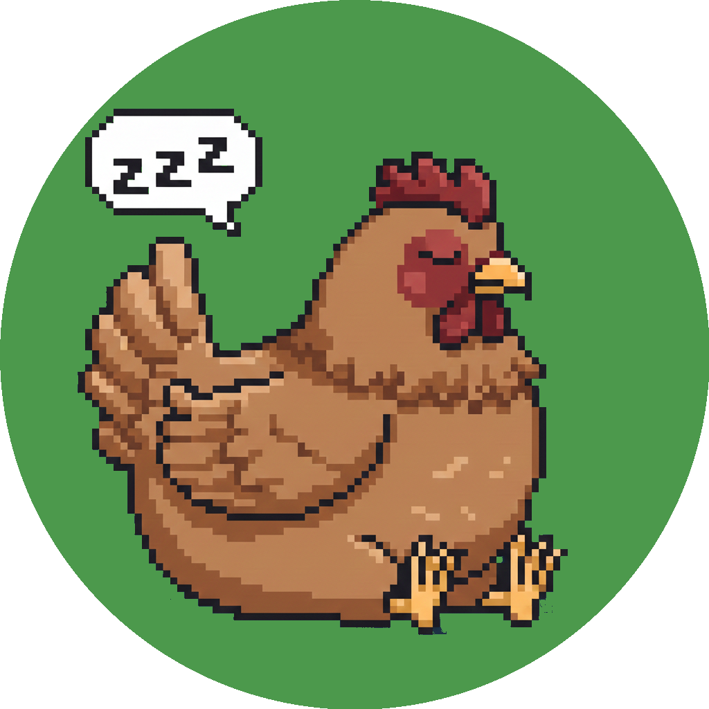

<p align="center">
  
</p>

# coop

AIをバックエンドとした、タスク管理・Slackメンション対応を支援するツール。
Slackでメンションされると行動指針を踏まえた優先度判定付きの通知が通知用チャンネルに届き、Notionにタスクが作られる。

```
   Slack @mentions      Your Guidelines     Task Store          Calendar
   ┌─────────────┐     ┌──────────────┐    ┌──────────────┐    ┌──────────────┐
   │  "Can you   │     │  Short-term  │    │  Existing    │    │  Meetings    │
   │   review    │     │  Mid-term    │    │  tasks with  │    │  & Events    │
   │   this PR?" │     │  Long-term   │    │  status &    │    │              │
   │             │     │ (Notion etc.)│    │  estimates   │    │              │
   │             │     │              │    │(Notion etc.) │    │(Google etc.) │
   └──────┬──────┘     └──────┬───────┘    └──────┬───────┘    └──────┬───────┘
          │                   │                   │                   │
          └───────────┬───────┴───────────────────┴───────────────────┘
                      │
                      ▼
            ┌───────────────────┐        ┌─────────────────┐
            │                   │        │  LLM Backend    │
            │    🐔 coop        ├───────►│                 │
            │                   │        │ Claude / OpenAI │
            │  Your AI manager  │◄───────┤ etc.            │
            │  that never sleeps│        │                 │
            │                   │        └─────────────────┘
            └─────────┬─────────┘
                      │
      ┌───────────────┼───────────────┐
      │               │               │
      ▼               ▼               ▼
   ┌────────────┐ ┌────────────┐ ┌──────────────┐
   │Daily Brief │ │Weekly Brief│ │ Smart Tasks  │
   │            │ │            │ │              │
   │"Here's your│ │ Milestone  │ │ Auto-created │
   │ day, boss."│ │ check-in & │ │ with priority│
   │            │ │ guideline  │ │ & estimates  │
   │ Priorities,│ │ feedback   │ │              │
   │ estimates, │ │            │ │ From every   │
   │ & schedule │ │"Are you    │ │ mention you  │
   │ around MTGs│ │ heading    │ │ receive      │
   │            │ │ the right  │ │              │
   │            │ │ direction?"│ │              │
   └─────┬──────┘ └─────┬──────┘ └──────┬───────┘
         │              │               │
         └──────────────┴───────────────┘
                        │
                        ▼
             ┌─────────────────────┐
             │  Slack notification │
             │  channel            │
             │                     │
             │  Everything in one  │
             │  place. You act.    │
             └─────────────────────┘
```

## 必要な環境

- GHC 9.6
- cabal 3.10+

## ビルド

```sh
cabal build
```

## テスト

```sh
cabal test
```

## 起動

### Dryrunモード

外部サービス（Slack / Claude / Notion）への実際のリクエストを行わず、すべてログ出力に置き換えるモード。API keyは不要。

```sh
cabal run coop -- --config config/coop-dryrun.dhall
```

起動後の動作確認:

```sh
# ヘルスチェック
curl http://localhost:3000/health

# Slack URL verification（Slack App設定時に必要）
curl -X POST http://localhost:3000/slack/events \
  -H "Content-Type: application/octet-stream" \
  -d '{"type":"url_verification","challenge":"test"}'

# メンションイベントのシミュレーション（監視対象ユーザーへのメンション）
curl -X POST http://localhost:3000/slack/events \
  -H "Content-Type: application/octet-stream" \
  -d '{"type":"event_callback","event":{"type":"message","channel":"C001","ts":"1234.5678","user":"U999","text":"<@U_DRYRUN_MONITORED> 本番のログインバグを直して"}}'
```

### Liveモード

`.env` ファイルまたは環境変数を設定してからLive用の設定ファイルで起動する。
`.env.example` をコピーして値を埋める。

```sh
cp .env.example .env
# .env を編集して各値を設定
cabal run coop -- --config config/coop.dhall
```

## 環境変数一覧

| 変数名 | 説明 |
|--------|------|
| `SLACK_BOT_TOKEN` | Slack Bot User OAuth Token (`xoxb-...`) |
| `SLACK_SIGNING_SECRET` | Slack App の Signing Secret |
| `SLACK_BOT_USER_ID` | Bot の User ID（`U...`） |
| `SLACK_MONITORED_USER_ID` | 監視対象ユーザーの User ID（`U...`） |
| `SLACK_NOTIFY_CHANNEL` | 通知先チャンネルID（`C...`） |
| `SLACK_APP_TOKEN` | Slack App-Level Token（Socket Mode用, `xapp-...`） |
| `SLACK_SOCKET_MODE` | `True` で Socket Mode、省略または `False` で Webhook |
| `COOP_DRYRUN` | `True` で Dryrun モード |
| `LOG_LEVEL` | ログレベル（`DEBUG`, `INFO`, `WARNING`, `ERROR`。デフォルト: `INFO`） |
| `LLM_BACKEND` | LLMバックエンド（`Claude` or `OpenAI`。デフォルト: `Claude`） |
| `CLAUDE_API_KEY` | Anthropic API key（Claude使用時） |
| `OPENAI_API_KEY` | OpenAI API key（OpenAI使用時） |
| `OPENAI_MODEL` | OpenAIモデル名（デフォルト: `gpt-4o`） |
| `NOTION_API_KEY` | Notion Integration Token |
| `NOTION_TASK_DATABASE_ID` | タスク管理用 Notion Database の ID |
| `NOTION_GUIDELINES_PAGE_ID` | 行動指針ドキュメントの Notion Page ID |
| `NOTION_INSTRUCTIONS_PAGE_ID` | LLM指示ドキュメントの Notion Page ID |
| `NOTION_PROP_NAME` | タスク名プロパティ名（デフォルト: `Name`） |
| `NOTION_PROP_PRIORITY` | 優先度プロパティ名（空で無効。デフォルト: `Priority`） |
| `NOTION_PROP_STATUS` | ステータスプロパティ名（空で無効。デフォルト: `Status`） |
| `NOTION_PROP_DUE_DATE` | 期日プロパティ名（空で無効。デフォルト: 空） |
| `NOTION_STATUS_OPEN` | Open状態の表示名（デフォルト: `Open`） |
| `NOTION_STATUS_IN_PROGRESS` | InProgress状態の表示名（デフォルト: `In Progress`） |
| `NOTION_STATUS_DONE` | Done状態の表示名（デフォルト: `Done`） |

## Docker

```sh
# Dryrunモードで起動
docker compose up

# Liveモードで起動（.envファイルまたは環境変数を設定済みの前提）
docker compose run -e CONFIG=config/coop.dhall coop --config config/coop.dhall
```

ngrok の管理画面: http://localhost:4040

## Slack App セットアップ

### 1. アプリ作成

[Slack API](https://api.slack.com/apps) で新しいアプリを作成する。

### 2. Socket Mode を有効化

- **Settings > Socket Mode** → 有効化
- App-Level Token を生成（スコープ: `connections:write`）
- 生成されたトークン (`xapp-...`) を `SLACK_APP_TOKEN` に設定

### 3. Event Subscriptions

- **Features > Event Subscriptions** → 有効化
- **Subscribe to bot events** に以下を追加:
  - `message.channels` — パブリックチャンネルのメッセージ受信
  - `message.groups` — プライベートチャンネルのメッセージ受信（必要な場合）

> Webhook モードの場合は Request URL に `https://<host>/slack/events` を設定する。

### 4. OAuth & Permissions

**Bot Token Scopes** に以下を追加:

| スコープ | 用途 |
|---|---|
| `chat:write` | タスク作成結果のスレッド返信・通知チャンネルへの投稿 |
| `channels:history` | パブリックチャンネルのメッセージ受信 |
| `groups:history` | プライベートチャンネルのメッセージ受信（必要な場合） |

スコープ追加後、**Install to Workspace** でワークスペースに再インストールする。

### 5. トークン・IDの取得

| 値 | 取得場所 |
|---|---|
| `SLACK_BOT_TOKEN` (`xoxb-...`) | **OAuth & Permissions** > Bot User OAuth Token |
| `SLACK_SIGNING_SECRET` | **Basic Information** > Signing Secret |
| `SLACK_APP_TOKEN` (`xapp-...`) | **Basic Information** > App-Level Tokens |
| `SLACK_BOT_USER_ID` (`U...`) | Slack上でbotのプロフィールを開き、IDをコピー |
| `SLACK_MONITORED_USER_ID` (`U...`) | 監視対象ユーザーのプロフィールからIDをコピー |
| `SLACK_NOTIFY_CHANNEL` (`C...`) | 通知先チャンネルのチャンネルIDをコピー |

### 6. チャンネルへの招待

botを以下のチャンネルに招待する（チャンネル内で `/invite @bot名`）:

- メンションを監視するチャンネル
- 通知先チャンネル（`SLACK_NOTIFY_CHANNEL`）

## Notion セットアップ

### 1. インテグレーション作成

[Notion Integrations](https://www.notion.so/my-integrations) で新しいインテグレーションを作成する。

- 種類: Internal
- 権限: コンテンツの読み取り・更新・挿入

生成されたトークン (`ntn_...`) を `NOTION_API_KEY` に設定する。

### 2. タスク管理用データベースの準備

Notion上でタスク管理用のデータベースを作成する。以下のプロパティを設定:

| プロパティ | タイプ | 環境変数 | デフォルト |
|---|---|---|---|
| タスク名 | Title | `NOTION_PROP_NAME` | `Name` |
| 優先度 | Select | `NOTION_PROP_PRIORITY` | `Priority` |
| ステータス | Status | `NOTION_PROP_STATUS` | `Status` |
| 期日 | Date | `NOTION_PROP_DUE_DATE` | （空 = 使わない） |

**Priority (Select)** のオプション: `Critical`, `High`, `Medium`, `Low`

**Status** のオプション名はデフォルトで `Open`, `In Progress`, `Done` を想定。
カスタム名を使う場合は環境変数で指定:

```
NOTION_STATUS_OPEN=未着手
NOTION_STATUS_IN_PROGRESS=進行中
NOTION_STATUS_DONE=完了
```

> Priority や Status を使わない場合は、対応する環境変数を空文字に設定するとスキップされる。

### 3. データベースとページの共有

作成したインテグレーションに以下を共有する（各ページ右上の「...」→「コネクト」→インテグレーション名を選択）:

- タスク管理データベース → `NOTION_TASK_DATABASE_ID`
- 行動指針ページ → `NOTION_GUIDELINES_PAGE_ID`
- LLM指示ページ → `NOTION_INSTRUCTIONS_PAGE_ID`

### 4. ページIDの取得

NotionのページURLからIDを取得する:

```
https://www.notion.so/ページ名-<32文字のID>
                               ^^^^^^^^^^^^^^^^
```

ハイフンを含む場合はそのまま使用可能。

## 設定ファイル

Dhall形式。`config/` 以下にテンプレートがある。

- `config/coop-dryrun.dhall` — Dryrunモード用（API key不要）
- `config/coop.dhall` — Liveモード用（環境変数から読み込み）

## プロジェクト構成

```
src/Coop/
  Config.hs              -- Dhall設定の型定義・読み込み
  Domain/                -- ドメイン型（Task, Mention, LLM, Doc, Notification）
  Effect/                -- 型クラスインターフェース（TaskStore, DocStore, LLM, Notifier）
  Adapter/
    Dryrun/              -- ログ出力・インメモリの疑似実装
    Claude/              -- Claude Messages API クライアント
    Notion/              -- Notion API クライアント（DocStore + TaskStore）
    Slack/               -- Slack chat.postMessage による通知
  Agent/
    Core.hs              -- メンション→分析→タスク作成→通知のパイプライン
    Context.hs           -- 行動指針・LLM指示の取得
    Prompt.hs            -- LLMプロンプト構築・レスポンスパース
  Server/
    API.hs               -- Servant API型定義
    Handlers.hs          -- リクエストハンドラ・署名検証
  App/
    Env.hs               -- Env レコード・Ops レコード
    Monad.hs             -- AppM モナド・型クラスインスタンス
    Log.hs               -- Katip ログ設定
```
